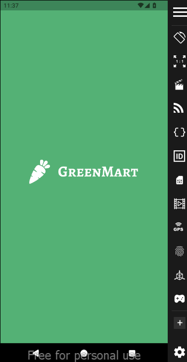
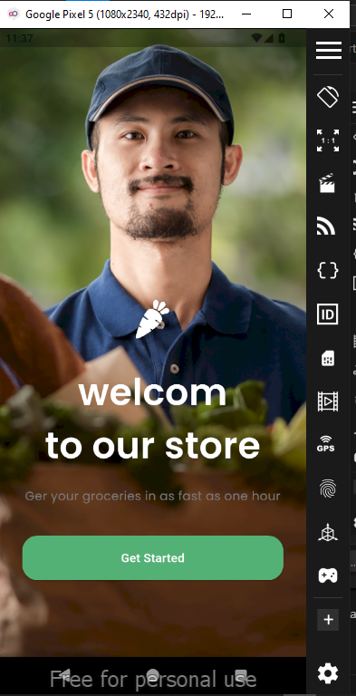
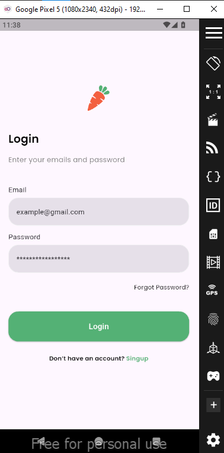
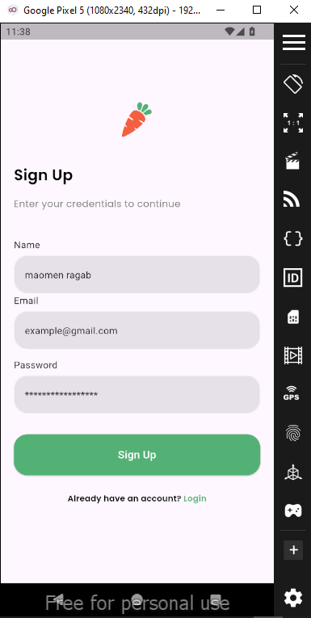

# 🥕 GreenMart

GreenMart is a Flutter-based e-commerce mobile application focused on groceries and daily essentials. The project is built with scalability and clean architecture in mind, making it easy to extend with new features over time.

---

## 📌 Project Overview

* Modern Flutter UI
* Clean, feature-based architecture
* Reusable core components
* Ready for backend & state management integration

---

## 📁 Project Structure

```
lib/
│── Core/
│   ├── constants/        # App constants & assets paths
│   ├── functions/        # Helper functions (navigation, utilities)
│   ├── stayels/          # App colors & text styles
│   └── widgets/          # Shared reusable widgets
│
│── Features/
│   ├── auth/             # Authentication feature
│   ├── intro/            # Intro & onboarding feature
│   └── (more features)   # Products, cart, orders, etc.
│
│── main.dart             # App entry point
```

---

## 🛠️ Tech Stack

* Flutter
* Dart

---

## 📸 Screenshots

> Screenshots of the application UI.
<p align="center">
  
  
</p>
<p align="center">
  
    
</p>


